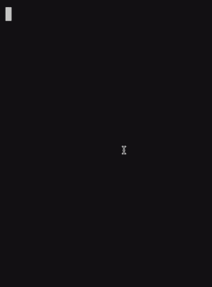

# Go nano-snake


A simple Shell Snake game implementation in Go, as a proof-of-concept for a tribit-based board game state representation — taking only [100 bytes](#board-grid-state) for the core game state.

---


## Summary

Nano-snake is a playable Snake shell game, backed by a pre-allocated highly compact game board grid. In addition to exploring some of Go language features & capabilities, the main purpose of this project was to experiment with the concept of having a compact and fixed state representation for a Snake game board. 

[<br>(view on asciinema)](https://asciinema.org/a/658992)

### Controls

Key(s) | Control
:-----:|:--------
 Up / Down / Left / Right | Move the snake (set next position)
q (or Ctrl+C) | Quit
n | New game (restart)
p | Pause 

## Building

Building from source requires go 1.22. For the best experience, the recommended approach for building is using [Devbox](https://github.com/jetify-com/devbox) ([below](#building-via-devbox)). Alternatively, check [devbox.json](./devbox.json) for the `build` command, which should be something like:

```sh
$ go build -C cmd/snake -o ../../out/snake -ldflags \"-s -w\" -buildvcs=false -trimpath
```

### Building via Devbox

The recommended option for building is using Devbox, which is a command-line tool for easily creating isolated shells for development. To build using Devbox, run the following on the base directory of the project:

```sh
$ devbox run build
```

Then run with:

```sh
$ ./out/snake
```

## State structure

### Head & tail coordinates
By design, this implementation supports boards of up to 16 blocks of width and height. This is to allow keeping track of head & tail positions on a single byte each: most significant bits represent the `x` offset, while the second nibble tracks the `y` position.

```
01101001
^^^^      x position == 0110
    ^^^^  y position == 1001

```

### Grid entity modeling
All possible grid positions are stored as part of the game board state, with each position represented by using 3 bits only. The first bit identifies whether the position tracks a Snake body part or not. Should it represent a Snake body block (bit set to `1`), then the remaining 2 bits will describe the direction of that segment (more on this below). Otherwise, if the first bit is a `0`, the remaining bits are used to flag the presence of an Apple (second bit set to `1`; last bit ignored) or an empty block (remaining bits set to `0`). 

Examples:

```
1xx // Snake with direction xx
000 // empty block
010 // apple
```

The direction bits of a Snake body part keep track of where the Snake was going towards when entering that block. It is used both for understanding where the head should be moving, as well as to shorten the tail (by clearing the block where the tail is at and moving the tail position towards the tracked direction). The two bits represent a clockwise orientation, with the following directions:

```
00 // up
01 // right
10 // down
11 // left
```

### Board grid state

The board grid is made of a `3` (3 bits per grid position) * `width` * `height` / `8` byte array. Given the default static configuration of a `16x16` board, it means that 96 bytes are used to model each and every cell. 

For the game logic itself, two extra bytes are required for keeping track of the head & tail coordinates, making it 98 bytes total. Finally, a `uint16` is used to keep the score count — so if we were to export & save resumable game state, in theory **only 100 bytes would be required for a 16x16 snake game** (at any playable stage).

As an example of what the board state might look like (excluding head, tail and score), a 4x4 grid example could be represented as following binary sequence:
```
00000000 00000101 11111000 00000010 00000000 00000000
```

(6 bytes: `0x00`,`0x05`,`0xF8`,`0x02`,`0x00`, `0x00`)

For simplifying visualisation of the above, splitting it by 3 bits and displaying as row & columns:
```

000 000 000 000

010 111 111 000

000 000 100 000

000 000 000 000

```

On this example, the first and last rows have only empty cells (`000`). The second row starts with an apple (`010`) followed by two left-pointing snake body parts (`111`). Finally, on the third column of the third row is the snake tail, pointing up (`100`).

Rendering this sequence — using `x` as an apple, `■` as the snake and `·` as an empty cell — would result in the following:

```
· · · · 
x ■ ■ ·
· · ■ ·
· · · ·
```
 
## Additional notes

This go module has a single external dependency on `atomicgo.dev/keyboard`, for control bindings. Note that there no unit tests were implemented (this is simply a proof of concept), so please don't deploy it to production. :)

Game logic might be innacurate (attempt without checking any reference implementation), there is no "game over message" or fancy sounds. A UNIX terminal with support for [ANSI escape codes](https://en.wikipedia.org/wiki/ANSI_escape_code) is expected, for color controls and cursor support (tested on macOS running a [Zsh](https://en.wikipedia.org/wiki/Z_shell) shell on a [iTerm2](https://en.wikipedia.org/wiki/ITerm2) terminal).